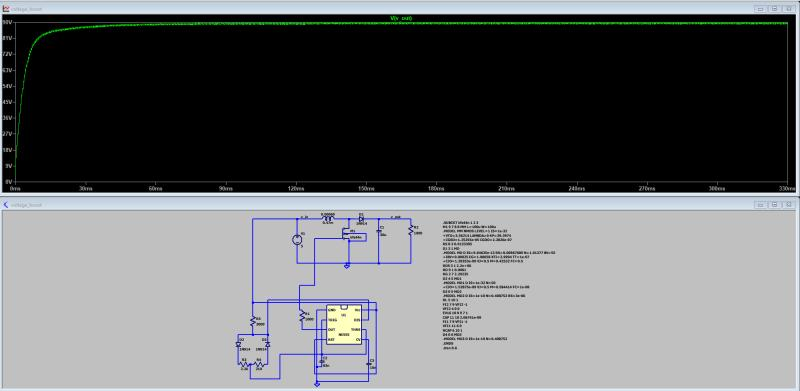
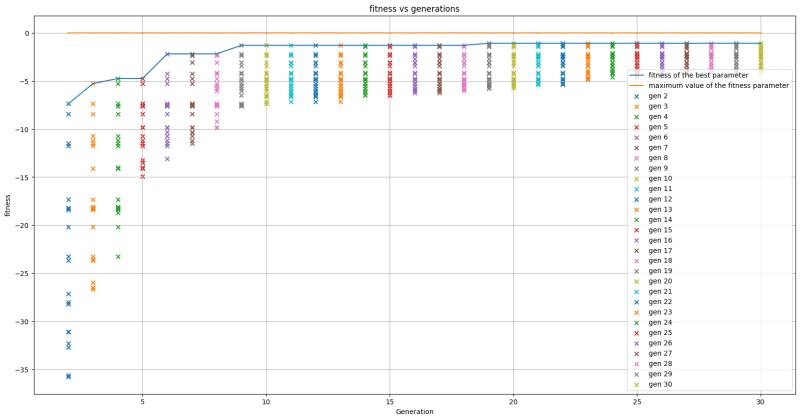

# Design-Space-Exploration-of-alanog-circuits-using-genetic-algorithm-
Design Space Exploration of alanog circuits using genetic algorithm 
Finding optimal component values in analog circuits is often challenging. Traditional design can produce impractical values (e.g., non-standard resistor or capacitor sizes), forcing designers to rely on approximations and settle for suboptimal results.
To overcome this, I combined a Genetic Algorithm with PyLTSpice to automate design space exploration in LTSpice. As a test case, I optimized a boost converter (5V → 90V for a 1kΩ load). The search space consisted of ~11.5 million possible parameter combinations, yet the GA converged on an optimal solution in just 41 minutes. The resulting circuit achieved:
Median output: 89.44V (only 0.56V off target) with a variance of 0.53V in the steady state.
This project highlights how evolutionary algorithms, when paired with simulation automation tools like PyLTSpice, can significantly accelerate analog design optimization.
I’m looking forward to connecting with like-minded people exploring Design Space Exploration, circuit automation, and evolutionary computation.Finding optimal component values in analog circuits is often challenging. Traditional design can produce impractical values (e.g., non-standard resistor or capacitor sizes), forcing designers to rely on approximations and settle for suboptimal results.
To overcome this, I combined a Genetic Algorithm with PyLTSpice to automate design space exploration in LTSpice. As a test case, I optimized a boost converter (5V → 90V for a 1kΩ load). The search space consisted of ~11.5 million possible parameter combinations, yet the GA converged on an optimal solution in just 41 minutes. The resulting circuit achieved:
Median output: 89.44V (only 0.56V off target) with a variance of 0.53V in the steady state.
This project highlights how evolutionary algorithms, when paired with simulation automation tools like PyLTSpice, can significantly accelerate analog design optimization.
I’m looking forward to connecting with like-minded people exploring Design Space Exploration, circuit automation, and evolutionary computation.

# Demonstration 

The following section shows a small demonstration in which the RLC parameters of a voltage boost circuit is being estimated using the genetic algorithm . The circuit boost 5V to 90V for a 1kΩ load. The shematic of the circuit is as shown in the figure along with the optimized parameters

## Schematic 

It could be seen that the design space contains 5 variables in total as lited below along with the possible values 

* R_1 = [10,15,22,33,47,68,100,220,330,470,1e3,1.5e3,2.2e3,3.3e3,4.7e3,5.6e3,6.8e3,8.2e3,10e3,15e3,22e3,33e3,47e3,56e3,68e3,100e3,150e3,220e3,330e3,470e3]
* R_2 = [10,15,22,33,47,68,100,220,330,470,1e3,1.5e3,2.2e3,3.3e3,4.7e3,5.6e3,6.8e3,8.2e3,10e3,15e3,22e3,33e3,47e3,56e3,68e3,100e3,150e3,220e3,330e3,470e3]
* R_3 = [10,15,22,33,47,68,100,220,330,470,1e3,1.5e3,2.2e3,3.3e3,4.7e3,5.6e3,6.8e3,8.2e3,10e3,15e3,22e3,33e3,47e3,56e3,68e3,100e3,150e3,220e3,330e3,470e3]
* R_4 = [10,15,22,33,47,68,100,220,330,470,1e3,1.5e3,2.2e3,3.3e3,4.7e3,5.6e3,6.8e3,8.2e3,10e3,15e3,22e3,33e3,47e3,56e3,68e3,100e3,150e3,220e3,330e3,470e3]
* C_1 = [1e-6,2.2e-6,3.3e-6,4.7e-6,6.8e-6,10e-6,15e-6,22e-6,33e-6,47e-6,68e-6,100e-6,150e-6,220e-6,330e-6,470e-6,680e-6,1e-3,1.5e-3,2.2e-3,3.3e-3,4.7e-3,10e-3,20e-3,100e-3]
* L_1 = [0.1e-6,0.22e-6,0.47e-6,1e-6,2.2e-6,3.3e-6,4.7e-6,10e-6,22e-6,33e-6,47e-6,100e-6,220e-6]

  This sums up to a total of 11.5M possibel solutions. The genetic algorithm used in this case has found the optimum values in 41 minutes (without multiprocessing). The fitness of the GA on each generations is as shown in the following figure.
     
## Fitness curve

     
